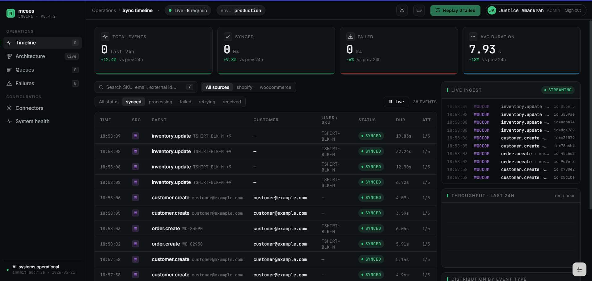
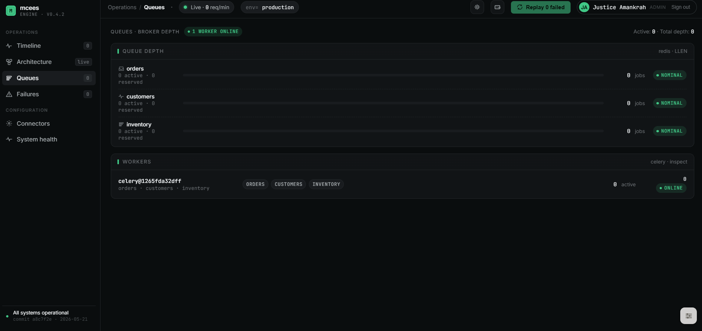

# MULTI-CHANNEL E-COMMERCE & ERP SYNC ENGINE (mcees engine)

> A production-grade async integration middleware that bridges Shopify and WooCommerce webhooks to an Odoo 17 ERP — built to handle high-frequency event spikes without overwhelming the ERP backend.

    

---

## Screenshots

> _Replace these placeholders with real captures from your running stack._

| Sync timeline (live, 5s auto-refresh) | Event detail drawer |
|---|---|
|  |  |

| Queues & workers | Sign-in (RBAC) |
|---|---|
|  |  |

How to capture them:
1. `make up` and `make db-seed` (creates the admin user)
2. Log in at `http://localhost:3000`, run a few webhooks via `make webhook-shopify-order`
3. Screenshot each view; save under `docs/screenshots/` with the names above
4. (Optional) record a 60-second flow as `docs/demo.gif` and link it here

---

## Overview

E-commerce platforms fire webhooks in bursts: a flash sale can generate hundreds of order events per minute. Sending each one directly to an ERP via synchronous XML-RPC would saturate the connection pool, produce cascading timeouts, and leave orders unsynced with no visibility into what failed or why.

**mcees_engine** solves this with a decoupled async pipeline:

1. A **FastAPI** ingestion layer validates HMAC signatures, writes an audit record, and immediately returns `202 Accepted`
2. Events are pushed onto a **Redis-backed Celery** queue, smoothing out traffic spikes
3. Dedicated workers process each event type — orders, customers, inventory — against **Odoo 17 via XML-RPC**, with exponential backoff retries and distributed locking for concurrent writes
4. A **Next.js 16** admin dashboard gives real-time visibility into every event — sync timeline, queue depth and worker stats, failure replay, health probes, and editable connector config — all behind a **JWT auth layer with role-based access control** (ADMIN / OPERATOR / VIEWER) enforced both by the Next.js proxy *and* per-route on every mutating endpoint

```
Shopify / WooCommerce
        │  HTTPS webhook
        ▼
┌─────────────────┐     INSERT row      ┌──────────────┐
│   FastAPI API   │ ──────────────────► │  PostgreSQL  │
│  HMAC verify    │                     │  WebhookEvent│
│  202 Accepted   │                     │  SyncLog     │
└────────┬────────┘                     └──────────────┘
         │ enqueue task                        ▲
         ▼                                     │ write status
┌─────────────────┐                     ┌──────┴───────┐
│     Redis       │ ──── consume ──────►│    Celery    │
│  (task broker)  │                     │   Workers    │
└─────────────────┘                     └──────┬───────┘
                                               │ XML-RPC
                                               ▼
                                        ┌─────────────┐
                                        │   Odoo 17   │
                                        │  sale.order │
                                        │  res.partner│
                                        │  stock.quant│
                                        └─────────────┘
                                               ▲
                                    ┌──────────┴──────────┐
                                    │  Next.js Dashboard  │
                                    │  Live sync timeline │
                                    │  KPI stat cards     │
                                    │  Event detail drawer│
                                    └─────────────────────┘
```

---

## Key Engineering Decisions

### HMAC Signature Verification
Every inbound webhook is verified before any processing begins. Shopify uses `X-Shopify-Hmac-Sha256` (HMAC-SHA256, base64-encoded); WooCommerce uses `X-Wc-Webhook-Signature`. Both use `hmac.compare_digest` to prevent timing attacks. Requests that fail verification are rejected with `401` before touching the database.

### Idempotent Event Ingestion
The `WebhookEvent` table has a `UNIQUE(source, external_id)` constraint. The insert uses `ON CONFLICT DO UPDATE … RETURNING id` so duplicate deliveries (Shopify re-sends on non-2xx) are handled gracefully — no duplicate orders in Odoo, no FK violations in the sync log.

### Exponential Backoff with Full Jitter
Workers inherit from `BaseTask`, which implements retry logic as `2^attempt + random(0, 1)` seconds. This spreads retry storms across time, preventing a wave of failed tasks from hammering Odoo simultaneously after it recovers from downtime. Max 5 retries; permanent failures flip the event status to `FAILED` and write an ERROR log entry.

### Distributed Lock on Inventory Writes
Concurrent webhooks for the same SKU could produce a race condition on `stock.quant`. The inventory worker acquires a Redis lock keyed on `inventory_lock:{sku}` with a 30-second TTL before touching Odoo. If the lock can't be acquired within 5 seconds, the task self-retries with backoff rather than blocking the worker thread.

### Additive Stock Adjustments
Incoming product webhooks carry a quantity delta, not an absolute target. The worker reads the current `stock.quant.quantity`, adds the incoming value, and writes the new total — so two concurrent receipts of 30 units each correctly land at +60, not at 30.

### Strict SKU-Only Matching
Products are resolved in Odoo by `default_code` (internal reference / SKU) only. There is no fuzzy name matching. Order lines with no matching SKU are skipped and logged as warnings rather than blocking the whole order. This makes data integrity issues visible without causing silent failures.

### Role-Based Access Control (Defense in Depth)
The dashboard sits behind a JWT cookie session (`jose`, HS256, httpOnly, SameSite=Lax). Three roles are enforced — `VIEWER` (read-only), `OPERATOR` (can retry / replay / simulate), `ADMIN` (full configure + reveal secrets). Authorization is checked in **two independent places**:

1. **Edge layer** — `dashboard/proxy.ts` (Next.js 16's replacement for `middleware.ts`) verifies the session on every request and redirects unauthenticated traffic to `/login` (or `401`s API calls)
2. **Route layer** — every mutating route handler calls `requireRole(min)` server-side, so even a forged client-side state can't bypass authorization

The UI also hides controls the user can't use (Replay button disabled for VIEWER, Connectors nav hidden for non-ADMINs) — but the server-side check is the source of truth, not the UI.

The first user to sign up is automatically promoted to `ADMIN`; subsequent signups default to `VIEWER` and must be elevated explicitly. Passwords are hashed with bcrypt (12 rounds).

---

## Tech Stack

| Layer | Technology |
|---|---|
| API | Python 3.12, FastAPI, uvicorn |
| Task queue | Celery 5, Redis 7 |
| Database | PostgreSQL 16 (asyncpg in API, psycopg2 in workers) |
| ORM (dashboard) | Prisma ORM (TypeScript) |
| ERP integration | Odoo 17 XML-RPC (`xmlrpc.client`) |
| Dashboard | Next.js 16 (App Router), React 19, TypeScript, Tailwind CSS, SWR |
| Auth | bcrypt + `jose` JWT (httpOnly cookie) + Next.js `proxy.ts` |
| Containerisation | Docker, Docker Compose |
| Packaging | uv, Hatchling (PEP 517) |
| Linting / types | Ruff, Pyright (backend) · TypeScript strict mode (frontend) |
| Testing | pytest (backend, 33 cases) · vitest (dashboard auth, 12 cases) |
| CI | GitHub Actions — backend pytest + dashboard vitest + Next.js build |

---

## Project Structure

```
mcees_engine/
├── backend/
│   ├── app/
│   │   ├── api/v1/
│   │   │   ├── webhooks/
│   │   │   │   ├── shopify.py          # Shopify order / product / customer endpoints
│   │   │   │   └── woocommerce.py      # WooCommerce mirror endpoints
│   │   │   └── internal.py             # Retry endpoint called by dashboard
│   │   ├── core/
│   │   │   ├── config.py               # pydantic-settings env config
│   │   │   ├── db.py                   # asyncpg connection pool
│   │   │   ├── hmac_verify.py          # HMAC dependency for FastAPI
│   │   │   └── queue.py                # idempotent event insert + Celery enqueue
│   │   ├── schemas/
│   │   │   ├── shopify.py              # Pydantic models for Shopify payloads
│   │   │   └── woocommerce.py          # Pydantic models for WooCommerce payloads
│   │   └── services/
│   │       ├── odoo_client.py          # XML-RPC client with timeout handling
│   │       └── mappers.py              # Payload → Odoo field dict transformations
│   ├── workers/
│   │   ├── celery_app.py               # Celery app + broker config
│   │   ├── base.py                     # BaseTask: retry/backoff/failure hooks
│   │   └── tasks/
│   │       ├── orders.py               # sale.order upsert + auto-confirm
│   │       ├── customers.py            # res.partner upsert by email
│   │       └── inventory.py            # stock.quant additive update + Redis lock
│   └── tests/
│       ├── test_hmac.py
│       ├── test_schemas.py
│       ├── test_mappers.py
│       ├── test_webhooks.py
│       └── test_workers.py
├── dashboard/
│   ├── app/
│   │   ├── (dashboard)/page.tsx        # Main dashboard page
│   │   └── api/sync-events/            # Next.js API routes
│   │       ├── route.ts                # GET list (paginated, filterable)
│   │       ├── [id]/route.ts           # GET event detail + logs
│   │       ├── [id]/retry/route.ts     # POST retry trigger
│   │       └── stats/route.ts          # GET KPI aggregates
│   ├── components/
│   │   ├── SyncTimeline.tsx            # Live auto-refresh event grid
│   │   ├── StatsBar.tsx                # KPI stat cards (24h)
│   │   ├── EventDrawer.tsx             # Slide-out detail + retry button
│   │   └── StatusChip.tsx              # Colour-coded status badge
│   └── prisma/
│       └── schema.prisma               # WebhookEvent + SyncLog models
├── docker-compose.yml                  # All 5 services wired together
├── Makefile                            # Dev workflow commands
└── .env.example
```

---

## Getting Started

### Prerequisites

- Docker and Docker Compose
- `make`
- `curl` and `openssl` (for webhook testing)

### 1. Clone and configure

```bash
git clone https://github.com/your-username/mcees_engine.git
cd mcees_engine
make env          # copies .env.example → .env
```

Open `.env` and fill in your Odoo connection details and webhook secrets:

```env
ODOO_URL=https://your-odoo-instance.com
ODOO_DB=your_database
ODOO_USER=admin@example.com
ODOO_PASSWORD=your_password

SHOPIFY_WEBHOOK_SECRET=your_shopify_secret
WOOCOMMERCE_WEBHOOK_SECRET=your_woocommerce_secret
```

### 2. Start the dev stack

```bash
make dev          # foreground, hot-reload, exposed DB ports
# or
make dev-detached # background
```

This layers `docker-compose.dev.yml` on top of the production base
`docker-compose.yml`, giving you bind-mounted source for hot reload
(api + dashboard) and exposed Postgres/Redis ports on the host.

### 3. Verify

```bash
make health        # → {"status": "ok"}
```

Open [http://localhost:3000](http://localhost:3000) for the admin dashboard.

### Running the production stack locally

To smoke-test exactly what runs in production (including Caddy + TLS):

```bash
cp .env.production.example .env
# fill in PUBLIC_DOMAIN, AUTH_SECRET, POSTGRES_PASSWORD, etc.
make prod-up
```

This starts the same stack you would deploy to a server — built images,
no bind mounts, restart policies, resource limits, Caddy fronting
everything on 80/443.

---

## Testing Webhooks Locally

The Makefile includes targets that generate a valid HMAC signature and fire a realistic payload at the local API. Every run uses a Unix timestamp as the external ID so each call creates a fresh event.

```bash
# Shopify order (override SKU and email)
make webhook-shopify-order SKU=TSHIRT-BLK-M EMAIL=test@example.com

# Shopify inventory receipt (+30 units added to current On Hand)
make webhook-shopify-product SKU=TSHIRT-BLK-M QTY=30

# Shopify customer upsert
make webhook-shopify-customer

# WooCommerce order
make webhook-woo-order SKU=TSHIRT-BLK-M

# WooCommerce customer
make webhook-woo-customer
```

Watch the worker process events in real time:

```bash
make logs-worker
```

---

## Dashboard Features

| Feature | Detail | Min role |
|---|---|---|
| **Live sync timeline** | Auto-refreshes every 5 seconds via SWR; filterable by source and status | VIEWER |
| **KPI cards** | Total events, synced, failed, and average processing time (24h window) | VIEWER |
| **Event detail drawer** | Raw JSON payload + full timestamped sync log (INFO / WARN / ERROR) | VIEWER |
| **Architecture view** | Live diagram of API → Redis → Workers → Odoo with per-edge status | VIEWER |
| **Queues view** | Real-time depth of `orders` / `customers` / `inventory` queues plus per-worker active/reserved counts | VIEWER |
| **Failures view** | Filterable list of FAILED events with bulk-replay action | VIEWER (view), OPERATOR (replay) |
| **System health view** | Redis ping + Odoo XML-RPC auth latency probe | VIEWER |
| **Retry button** | Re-enqueues any `FAILED` event with one click | OPERATOR |
| **Replay all failed** | Bulk re-enqueue of every FAILED event in one action | OPERATOR |
| **Connector settings** | Edit Shopify / WooCommerce / Odoo connection details from the UI; secrets revealed via separate endpoint | ADMIN |
| **Sign in / sign out** | Email + password, JWT cookie, 7-day expiry; first user becomes ADMIN | — |

---

## Development Commands

```bash
make setup              # Bootstrap venv, node_modules, and .env
make up                 # Build and start all services (detached)
make down               # Stop all containers
make restart-worker     # Restart Celery worker (picks up code changes)
make logs               # Tail logs from all services
make test               # Run pytest suite
make test-cov           # Run tests with coverage report
make lint               # Ruff lint check
make format             # Ruff auto-format
make typecheck          # Pyright type check
make db-studio          # Open Prisma Studio on port 5555
```

---

## Environment Variables

| Variable | Description |
|---|---|
| `POSTGRES_URL` | PostgreSQL connection string |
| `REDIS_URL` | Redis connection string |
| `ODOO_URL` | Odoo base URL (e.g. `https://mycompany.odoo.com`) |
| `ODOO_DB` | Odoo database name |
| `ODOO_USER` | Odoo login email |
| `ODOO_PASSWORD` | Odoo API key or password |
| `SHOPIFY_WEBHOOK_SECRET` | Shopify webhook signing secret |
| `WOOCOMMERCE_WEBHOOK_SECRET` | WooCommerce webhook signing secret |
| `MAX_PAYLOAD_BYTES` | Max accepted body size (default: 1 MB) |
| `AUTH_SECRET` | JWT signing key for dashboard sessions — must be ≥ 32 chars. Generate with `openssl rand -hex 32` |
| `SEED_ADMIN_EMAIL` | (optional) email for the seed admin user. Default: `admin@mcees.local` |
| `SEED_ADMIN_PASSWORD` | (optional) password for the seed admin user. Default: `admin12345` — change before any real demo |

---

## How Order Sync Works

1. Webhook arrives → HMAC verified → `WebhookEvent` row inserted with `status=RECEIVED` → `202` returned to platform
2. `sync_order` task picks up from Redis queue → status set to `PROCESSING`
3. Partner resolved by email (`res.partner` — create if not found)
4. Each line item looked up by SKU (`product.product.default_code`); unmatched SKUs are skipped and logged
5. Order upserted: if a `sale.order` with matching `client_order_ref` exists and is still in Draft, it is updated; otherwise a new order is created
6. New orders are immediately confirmed (`action_confirm`) so Odoo reserves stock and generates a delivery
7. Status set to `SYNCED`; full log written

On any exception the task retries up to 5 times with exponential backoff. After max retries, `on_failure` sets `status=FAILED` and writes an ERROR log — surfaced in the dashboard for manual retry.

---

## How Authentication Works

1. User submits credentials to `POST /api/auth/login` (or `/signup` for first-time accounts)
2. Server looks up the user, verifies the password with bcrypt (`compare` is constant-time)
3. On success, a JWT is signed with `jose` (HS256, 7-day expiry) carrying `{sub, email, name, role}`
4. JWT is returned as an `httpOnly`, `SameSite=Lax`, `Secure` (prod) cookie named `mcees_session`
5. Every subsequent request flows through `dashboard/proxy.ts`, which:
   - Reads the cookie, verifies the JWT, and exposes the session
   - Redirects unauthenticated browser traffic to `/login?next=<original>`
   - Returns `401 {error: "unauthenticated"}` for unauthenticated `/api/*` calls
6. Mutating route handlers additionally call `requireRole(min)` — even if the proxy is misconfigured or bypassed, the route returns `403 {error: "forbidden", requiredRole: "..."}`
7. Logout clears the cookie via `Set-Cookie: mcees_session=; Max-Age=0`

The first user to sign up is promoted to `ADMIN`; subsequent signups default to `VIEWER`. Promote others via `prisma studio` or a direct SQL `UPDATE`.

---

## Testing

```bash
# Backend
make test                          # pytest, 33 cases
make test-cov                      # with coverage report

# Dashboard (auth + permissions)
make test-dashboard                # vitest, 12 cases
cd dashboard && npm run test:watch # watch mode
```

CI runs both suites plus a production Next.js build on every push and PR — see `.github/workflows/ci.yml`.

---

## Design Decisions & Trade-offs

| Decision | Alternative considered | Why this won |
|---|---|---|
| Celery + Redis | RQ, Dramatiq | Mature ecosystem, battle-tested, monitoring built-in (`celery inspect`) |
| JWT in httpOnly cookie | Bearer token in localStorage | XSS-resistant; browser script cannot read the credential |
| `jose` (not `jsonwebtoken`) | `jsonwebtoken` | Edge-runtime safe, no native deps, actively maintained |
| Custom auth (not NextAuth.js) | Auth.js v5 | Total control over the cookie/role model; fewer moving parts to explain in interview |
| bcrypt (12 rounds) | argon2id | Wider deployment, fine for non-credential-stuffing-targeted internal tool. argon2id would win for a public consumer service |
| Strict SKU matching (no fuzzy) | Levenshtein fallback | Wrong product is worse than no product — visible warnings beat silent mis-syncs |
| Additive inventory updates | Absolute targets | Webhooks deliver deltas; absolute targets corrupt counts under reordering |
| Defense-in-depth (proxy + per-route) | Proxy only | Next.js docs explicitly warn that proxy matcher refactors can silently drop coverage |
| Prisma + raw asyncpg | Prisma everywhere | Python workers don't need an ORM; raw SQL is faster and the schema is small |

---

## What I'd Do Next

- [ ] Argon2id migration for new passwords (hash field already supports either via prefix detection)
- [ ] OAuth providers (Google / GitHub) alongside credentials
- [ ] Refresh-token rotation (current sessions are stateless 7-day JWTs)
- [ ] OpenTelemetry tracing across FastAPI → Celery → Odoo XML-RPC
- [ ] Saga pattern for multi-step Odoo transactions (currently each task is atomic but cross-task rollback is manual)
- [ ] WebSocket push for dashboard timeline (currently 5s SWR polling)
- [ ] Per-tenant isolation (multi-shop deployment)
- [ ] Load test with k6 to confirm the ~500 events/min/worker target

---

## Deployment Notes

The repo ships with two compose files:

- `docker-compose.yml` — production base: restart policies, resource limits,
  Caddy reverse proxy with auto-TLS, no source bind mounts, `--workers 2`
  uvicorn, Celery `--concurrency=4`, required env-var guards
- `docker-compose.dev.yml` — local-dev overlay: hot reload, exposed DB ports,
  bind-mounted source, `next dev` instead of the standalone build

**Recommended free production target:** Oracle Cloud Always Free
(4 vCPU ARM, 24 GB RAM, $0 forever). Step-by-step runbook in
[docs/DEPLOY_ORACLE_CLOUD.md](docs/DEPLOY_ORACLE_CLOUD.md).

**Other tested targets:**
- **Railway / Fly.io** (~$5/month) — easiest hosted; one project, services
  per Dockerfile. See the Railway-specific notes in `docs/DEPLOY_ORACLE_CLOUD.md`
  appendix for env-var wiring.
- **Any VPS with Docker** — `docker compose up -d` runs the production
  stack as-is. Point a DNS record at the VM, set `PUBLIC_DOMAIN` +
  `ACME_EMAIL` in `.env`, and Caddy will provision a Let's Encrypt cert
  on first request.

**Per-environment hygiene:**
- Always rotate `AUTH_SECRET` per environment — JWTs signed with one
  secret cannot be verified by another, so leaking the staging secret
  doesn't compromise prod
- Set `NODE_ENV=production` in the dashboard service so cookies become
  `Secure` (the prod compose does this automatically)
- Never commit `.env` (already in `.gitignore`); use `.env.production.example`
  as the template on the server

---

## License

MIT
